===============================================
Getting started with Coaslescence for Wordpress
===============================================

:Author: Steven Looman

.. contents::

Introduction
============

This document is a getting started guide for Coalescence for Wordpress. It gives a short overview on how to install and configure.

The installation steps describe installing Coalescence, and installating your own HTML theme in Coalescence. The configuration steps describe the steps to transforming the HTML theme and combining the Wordpress content with the HTML theme.

For this getting started guide, we will use the theme Beautiful Flower as an example. This is a free theme wich can be downloaded from `Free CSS Templates <http://www.freecsstemplates.org/preview/notableflower/>`_ or from the `Coalescence for Wordpress site <http://www.coalescencewp.com/wp-content/uploads/notableflower.zip>`_.

Installation
============

Installation of Coalescence
---------------------------

The easiest way to install Coalescence is to use the Wordpress theme upload functionality. You can do this by going to the Themes page, click on the `Install themes` tab and click on `upload`. There, you choose a file and upload the zip file which contains Coalescence, the zip file which you have downloaded. The following screenshot shows the page where you can upload the theme.

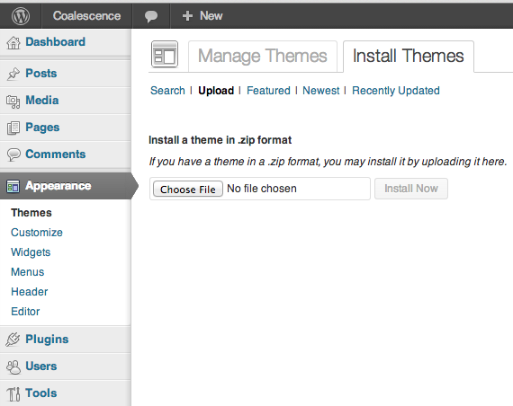

   Uploading Coalescence through Wordpress.

After you have uploaded the files, in the Wordpress menu, go to Appearance, and then Themes. Once you are at the themes configuration page in Wordpress, you should see Coalescence. Activate it, and the theme is installed. See the screenshot below.

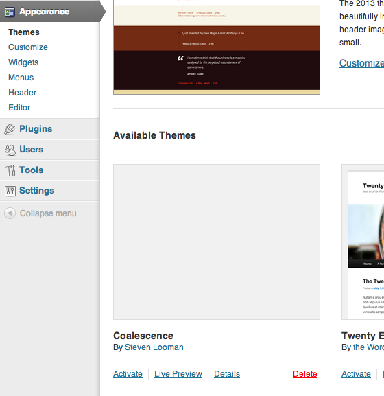

   Activation of the Coalescence theme.

For more information on installing and activating the theme, please consult the `Using Themes section <http://codex.wordpress.org/Using_Themes>`_ in the Wordpress documentation.

Uploading through ftp
~~~~~~~~~~~~~~~~~~~~~

If this does not work or you wish to upload via ftp, you can follow the steps below. Please check with your website hoster to get instruction on how to access your website through ftp.

Once you have access to your Wordpress site, you have to upload the whole directory called `coalescence` to the `wp-content/themes/` on the ftp. After you have uploaded the files, you should have a directory `wp-content/themes/coalescence`. See the screenshot below.

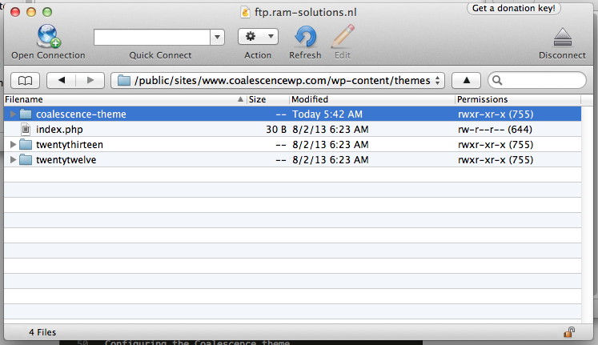

   Showing the directory where the Coalescence theme should be uploaded.

Then, activate the theme as specified in the previous section.

Adding the HTML theme
=====================

Once you have installed and activated Coalescence, you will see a dummy theme on your Wordpress site. To replace this dummy theme with your own HTML theme, you have to upload it to your site. This can ben done by using the Theme-zip-upload function of Coalescence, or through ftp access.

Uploading through HTML-Theme-zip-upload
---------------------------------------

Using the HTML-Theme-zip-upload functionality, you can simply upload a zip file containing the theme you have bought or downloaded. Coalescence will try to find the right path to the HTML Theme files and extract those files in the right place. Go to the tab `Upload HTML Theme` and press the button next to `Choose zip file`. Choose the Zip file containing the HTML theme. Finally, press the button `Upload`. Once the Zip file has been uploaded, you will see a massage `The HTML theme has been uploaded.`.

Immediately, in the rule configuration tab, you will see the new HTML theme is shown. You are ready to start configuring!

Uploading through ftp
---------------------

Please check with your website hoster to get instruction on how to access your website through ftp.

Go to the directory where you have uploaded Coalescence, probably `wp-content/themes/coalescence`. There, you will see a directory called `theme` (so, that will be `wp-content/themes/coalescence/theme`.) Enter the `theme` directory. You will see a file called `coalescence.html` there. In the screenshot below, the directory and the file `coalescence.html` is shown.

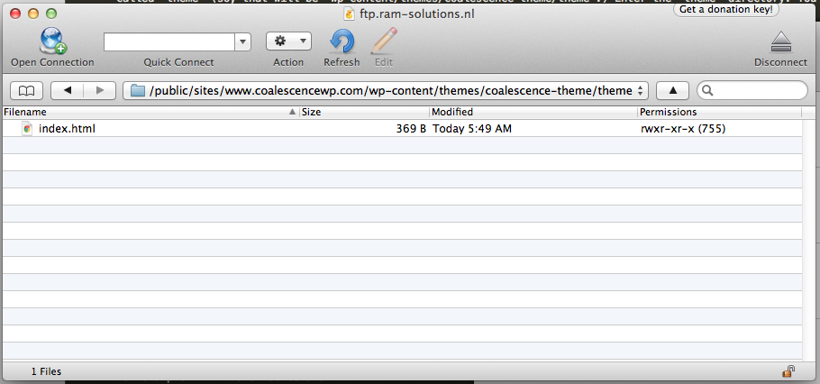

   The `theme` directory in the Coalescence folder, containing the default coalescence.html file.

Upload the files from your HTML theme in the `theme` directory. Your HTML theme will probably consist of one or more .html files, .css files, .js files, and some images. Make sure you copy all of them. When asked to overwrite the file `index.html`, do so. The next screenshot shows the resulting files on the ftp.

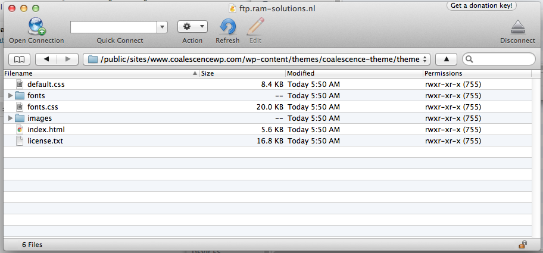

   The HTML theme uploaded in the `theme` directory of the Coalescence theme.

Your HTML theme is now installed. You can continue to configure the Coalescence theme!

Configuring Coalescence
=======================

Once Coalescence is installed, and the HTML theme is uploaded, we can start configuring.

The website usually consists of a few parts which are dynamic. Other parts are static. The dynamic parts usally are:

- the site title
- the site description (optional)
- the menu
- the content
- the footer
- widgets

When the configuration page of Coalescence is opened, you see two large panels. See the screenshot below. The left pane shows the WordPress site in a crude manner. All the elements are there, such as site title, menu, and the current article, but are not styled. The right pane shows the HTML theme, in our case Notable Flower.

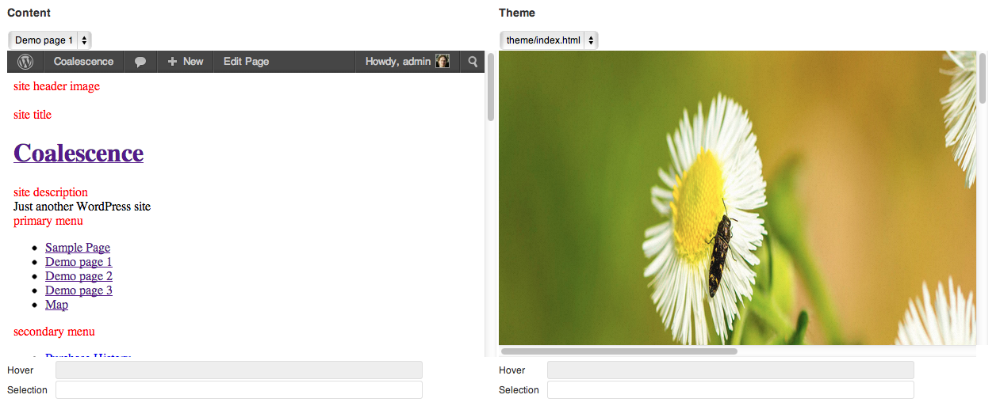

   Selector panels of the plugin, left the content, right the HTML theme

Below both panes there are two `selector-boxes` showing a `selector-expression`: the part on which your are hovering on, and the part wich you have selected (clicked on). See the previous screenshot. These `selector-expressions` are used to specify which part of the content has to be placed in which part of the HTML theme, for example.

Below that, there are is a rules section. These rules control how the content and HTML theme are modified and merged. There is a drop down box where you specify which template you want to apply the rules to. The rules in the `global` group are applied to all templates. The next screenshot shows the rules section.

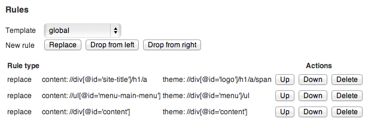

   Rules section of the plugin, first the `group` selector, then the rules belonging to that group

Below the rules section, there is the template to HTML file mapping. Some themes come with multiple HTML files for different kinds of pages. E.g., a page for the front-page, a page for the content pages, a page for the blog, etc. The screenshot below shows the template to HTML mapping section. Note that there always is a `default` template. When a template is not mapped to a HTML file, the default HTML file is chosen.

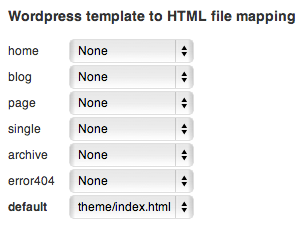

   Template to HTML mapping section of the plugin

Finally, at the bottom there is the `Save`-button. This saves all rules and Wordpress template to HTML mappings.

Replacing the site title
------------------------

Once in the Coalescence configuration page, the two large panels show the content of Wordpress and the HTML theme. The left panel shows Wordpress content, the right panels shows the HTML theme.

What we are going to do is select the site title in the left panel, and select the title title in the right panel, and say that the left site title should replace the right site title.

Since the title should always be copied, we are going to place this in the 'global' `group`. In the `rules` section, select the group 'global', as shown in the next screenshot.

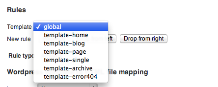

   Selecting the `global` rule group for the site title

In the left panel, all the different parts of the site are indicated by the title above it. Click on the large text, the title of your Wordpress site. Then, in the right panel, click on the site title, the text 'NOTABLEFLOWER'. Both parts in the panel should be highlighted by a yellow border. Once you have selected both titles in the panels, create a new rule by clicking on the button `Replace`. See the next two screenshots.

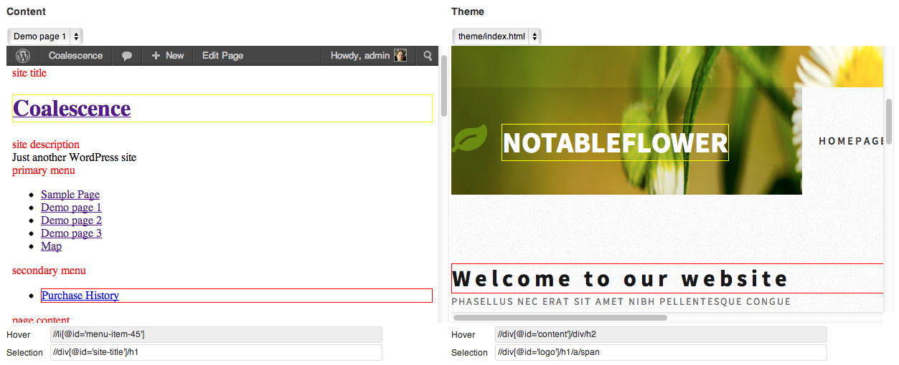

   Selecting the elements to be replaced

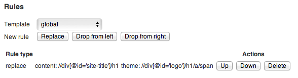

   Creating the `replace`-rule to replace the site title in the HTML theme

Then, to save the rule we have just created, click on the `Save` button at the bottom of the page. To see if the site title is replaced, open up a new tab and go to your Wordpress site. You should see the new theme, with the title of your Wordpress site. You should see that the title is replaced. The screenshot below shows the rusult.

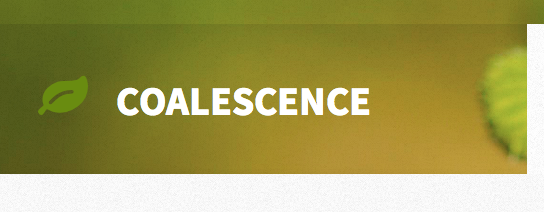

   Result of the replaced title

Replacing the menu
------------------

After the site title, we want to replace the menu. In the Notable Flower theme, the menu is found next to the site title.

Again, go to the Coalscence configuration page. In the left panel, select the menu primary menu. Notice that when you click on a menu item in the left panel, only that menu item is selected. Since the whole menu has to be replaced, we want to select all items - or rather, the list of menu items - at the same time. You can do this by clicking several times on the **same** menu item. Click three on the first menu item (on the menu item text itself.) You'll see that the whole menu is highlighted by a yellow border. Then, do the same in the right panel with the HTML theme. Click three times on one of the menu items (the text.) Again, the whole menu should be highlighted by a yellow border. The next screenshot shows the selected elements.

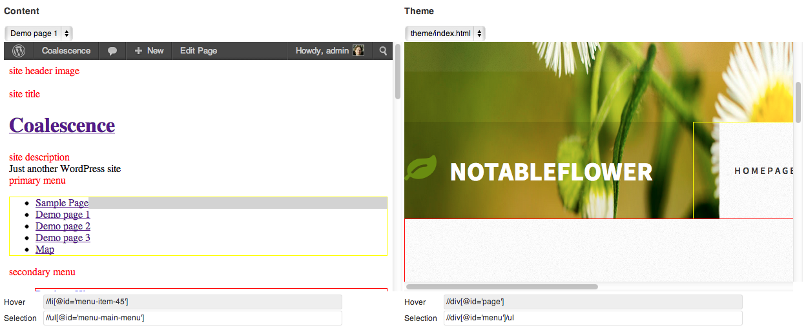

   Selecting the elements to replace the menu

Create a new rule by clicking on the button `Replace`. Then, click on the `Save` button at the bottom of the page so save our just created rule. The next screenshot shows the rules which have been created so far.

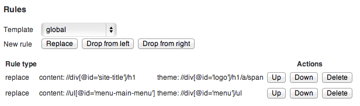

   The additional rule to replace the menu

Check the result in the other tab with your Wordpress site. You should see that menu is replaced. Success, as shown in the next screenshot!

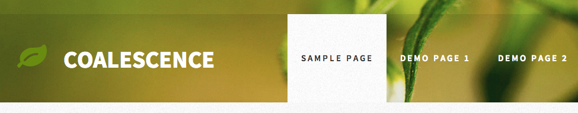

   Showing the replaced site menu

Replacing the content
---------------------

Maybe the most import part of the page is the content of the page itself. Currently, the default content from the static HTML file is still shown. We want to replace this with the content from our Wordpress site.

Go to the Coalescence configuration page. Select the content in the left panel. Make sure the you have selected all the content by checking if the yellow border is around all the content. The `selector` below the panel should state: //div[@id='content'] Then, in the right panel, select content by click the text 'Welcome to our website' three times. The `selector` below the panel should state: //div[@id='content'] The panels with selected elements are shown in the next screenshot.

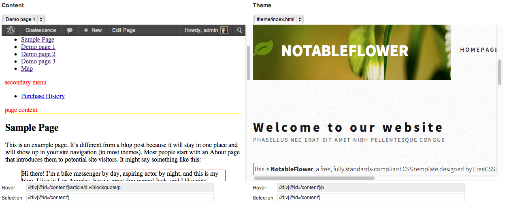

   Selecting the elements to replace the content

Again, we create a `replace` rule by clicking the button `Replace`. Save the rules by clicking on the `Save` button at the bottom of the page.

If you check your Wordpress site in the other tab, you should see that content is replaced, as shown in the next screenshot.

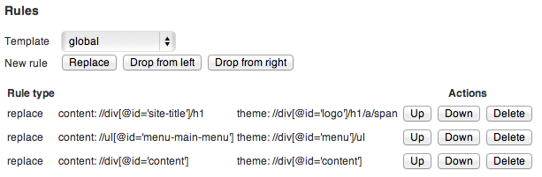

   The rule to replace the content

Adding a portfolio
------------------

In this example we are not interested in the portfolio at the bottom of the Notable Flower theme. We can easily drop this from the HTML theme from the Coalescence configuration page.

Go to the Coalescence configuration page. Then, in the right panel, click on the title 'Praesent scelerisque scelerisque' at the bottom of the page. You will see a yellow border around the large text. Click the same text two times more. You will see a yellow border around the title and the text below it. The `selector` below the panel should state: //div[@id='portfolio'] The screenshow below shows the panels with selected elements.

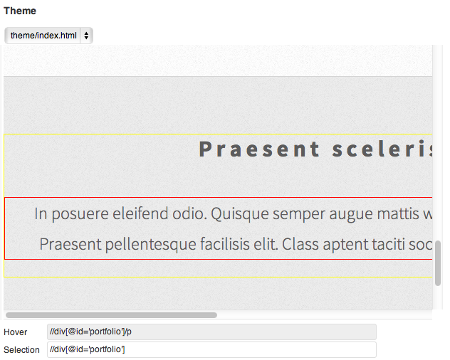

   Selecting the element to remove the portfolio

To drop this part of the HTML theme we have to instruct the Coalescence theme to remove that part. Click on the button `Drop from right`. The newly created rule is shown in the next screenshot.

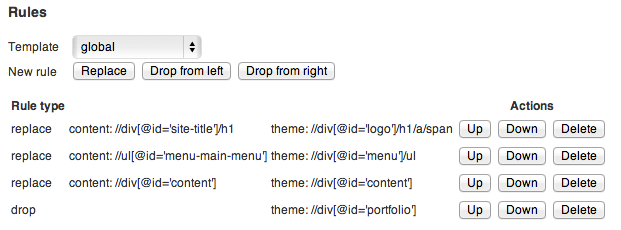

   The rule that drops the portfolio from the HTML theme

Then, save the rules by clicking the `Save`-button and check out the result in the other tab. The lower text is now removed. The result is shown in the screenshot below.

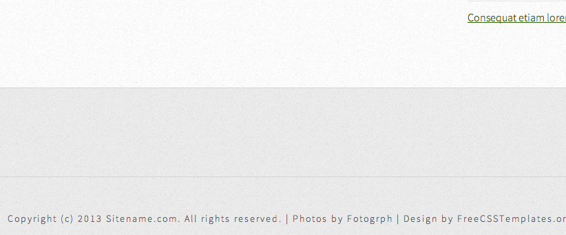

   The result of dropping the portfolio from the HTML theme

Filling the footer
------------------

The footer is similar to the steps above. In the left panel, click on the the text 'Proudly powered by Wordpress' until the selector below it states: //div[@id='wp-credits']

In the right panel, click the on the text 'Copyright (c) 2013 Sitename.com...' until the selector states below it states: //div[@id='copyright']

Create a rule by clicking the `Replace` button at the rules section, and the `Save` button at the bottom. Check the result in the other tab.

Adding widgets
--------------

Often, sites have additional 'panels' on the side for extra information such as contact information or testimonials. In Wordpress, such 'panels' are called `Widgets`. Widgets are a very powerful way of placing additional information on the website.

Widgets in Wordpress are placed on a `sidebar`. Each theme can have multiple sidebars. The Coalescence theme has four in total. Sidebars are shown depending on the page you are looking at:

- Frontpage sidebar: shown on the front-page
- Left sidebar: always available
- Right sidebar: always available
- 404 sidebar: shown on the 404 page
- Search sidebar: shown on the search results page

Different sidebars can be used for different purposes. For example, we can use the 404 sidebar to place helpful widgets for the visitor if s/he tries to open a page which does not exist, such as a text widget with hints where the visitor can find helpful links.

In the Notable Flower theme there are two widgets on the right, we want to replace the text in those widgets with our own. To do so, we have to create two widgets. Go to Appearance --> Widgets, in the left menu, and drag the bar with 'Text' to the 'Front page' sidebar on the right. Open the newly created widget, set a title: 'Contact', and add some content::

    

      Line 1 
      Line 2 
      Line 3
    

The next screenshot shows the widget with contents.

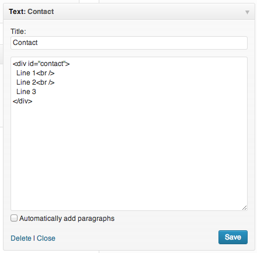

   Creating the widget in Wordpress

Go back to the Coalescence configuration page and find the widget we have just created. You can find the widget by looking for the text 'Contact'. Click on one of the lines below 'Contact' to select the text. The `selector` below the panel should state: //div[@id='contact'] In the right panel, select the first block of text. Click on the the title 'Mauris vulputate' three times. You should see a border around the block. Both the panels and selected elements are shown in the next screenshot.

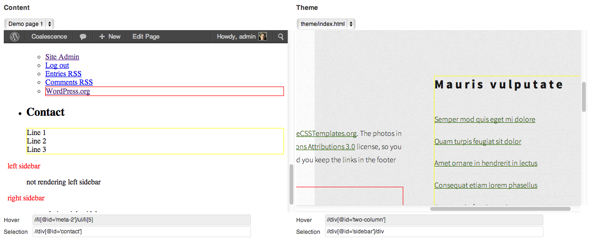

   Selecting the element to replace the widget

Replace the text by clicking on the `Replace` button. Use the `Save` button to save the rule we have just created. The resulting rules are shown in the screenshot below.

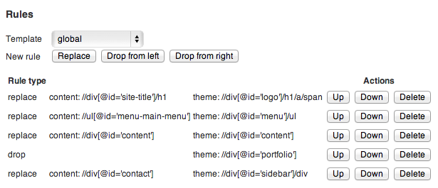

   The rule which has been created to for the contact widget

The result is that the first block of text on the right side in HTML theme will be replaced by our contact text. The next screenshot shows the result.

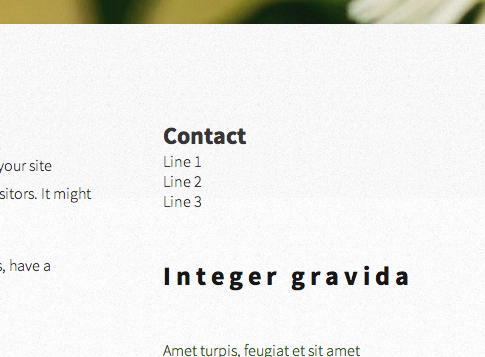

   The resulting page where the contact widget has been added

Conclusion
----------

We have just themed our Wordpress site using a static HTML theme. Without any programming! This document is meant as a quick start and doesn't show all the tips and tricks, but should help you to get up to speed. There are probably more items you wish to replace. Keep in mind that widgets are a powerful tool to add additional information.

Please see the documentation of the `Coalescence theme <index.html>`_ for more documentation.
